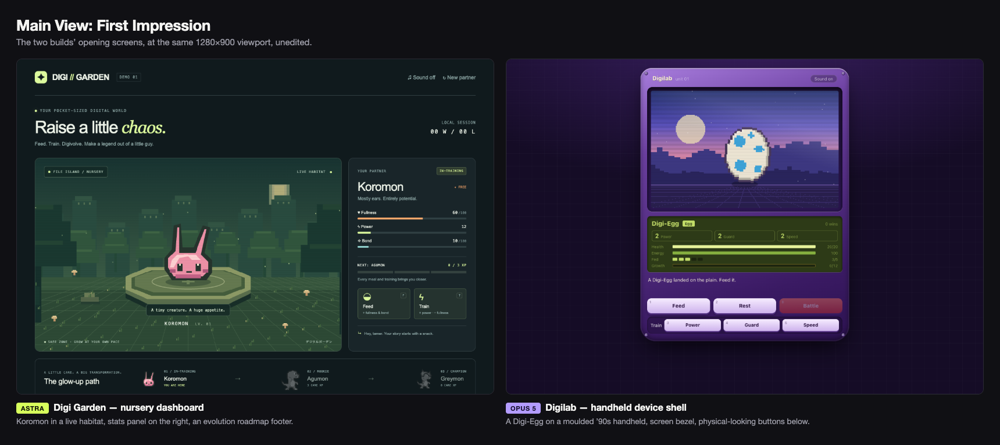
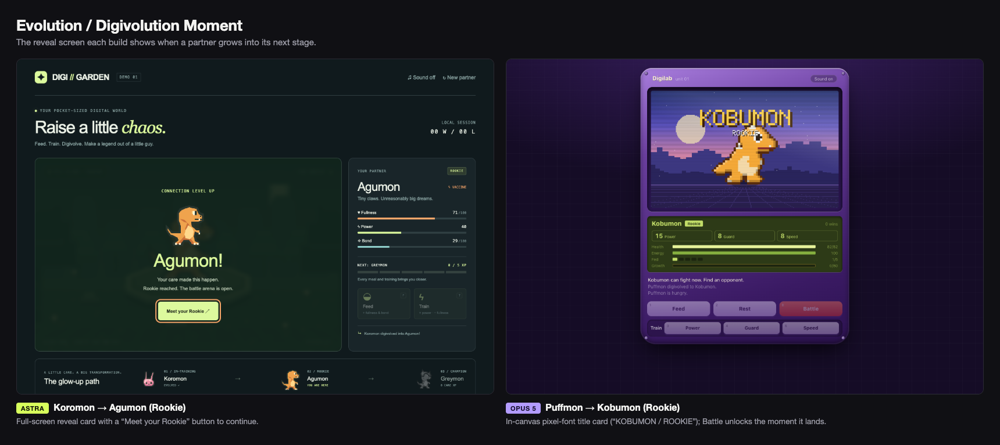
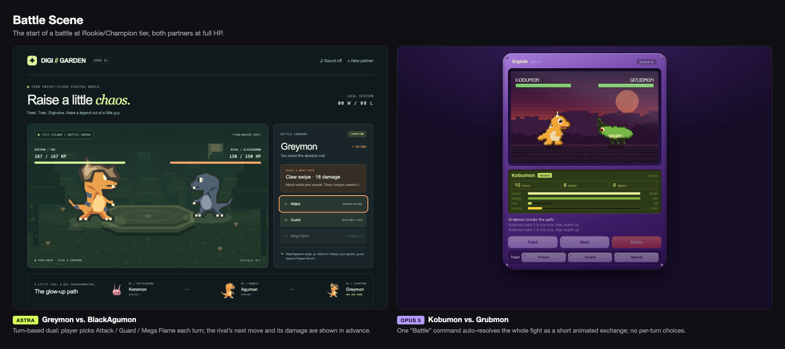

# GPT-6 Astra vs. Opus 5: Same-Brief Digimon Raising-Sim Comparison

## Same-Brief Agentic Build Comparison: A Digimon-Style Raising & Battle Demo

This case study compares how **GPT-6 Astra** and **Opus 5** independently built the
same small Digimon-style demo from the same brief: a self-contained, single-page
browser game where you raise a partner creature (feed it, train it, watch it evolve
through at least one stage) and then send it into a battle. Both were asked for a
playable demo — original artwork drawn in code, no build step, no external assets,
`file://`-openable — rather than a design document.

> **Note on evaluation type:** this is not a scientific benchmark. It is a
> same-brief build comparison based on one manual playthrough of each demo, with
> screenshots and a screen recording captured while driving both builds through
> `chrome-devtools-axi`.

Run date: **2026-09-08**

---

## 1. What Was Built

Both builds live in this repository and each documents its own scope and controls
in detail — read those first for the authoritative feature list:

- [`astra-build/README.md`](astra-build/README.md) — **Digi Garden**: Koromon →
  Agumon → Greymon, a canvas-drawn nursery habitat, and a turn-based battle against
  a rival BlackAgumon.
- [`opus5-build/README.md`](opus5-build/README.md) — **Digilab**: a Digi-Egg that
  hatches and grows through Nubbimon → Puffmon → Kobumon, then branches into one of
  three Champion forms, styled as a retro handheld device, with auto-resolving
  battles against rolled opponents.

There is no shared prompt file in this repository — each build came from its own
task dispatch — so nothing here quotes an original brief verbatim. The shared
starting point, as best it can be reconstructed from what both demos actually
implement, was: *build a small, self-contained Digimon-style raising sim — feed
and train a creature through at least one evolution, then let it fight.*

---

## 2. Main Observation

**Same brief, same core loop, very different execution of "battle."**

Both builds nailed the raising loop — feed/train resources, an evolution
threshold, a reveal moment, canvas-drawn original sprites, no external assets.
Where they diverge sharply is in visual identity and, more importantly, in how
much the player actually *does* during a fight:

- **Astra's build (Digi Garden)** looks like a dark dashboard/SaaS UI: a live
  canvas habitat sits next to an HTML stats panel with progress bars and an
  evolution roadmap footer. Digivolution is a full-screen HTML modal card with a
  "Continue" button that pauses the flow. Battle is a **turn-based duel** — each
  turn you explicitly pick Attack, Guard, or Mega Flame, the rival's next move and
  its damage are telegraphed in advance, and Mega Flame charges over three turns
  for a finishing blow. It reads as a small tactics game.
- **Opus 5's build (Digilab)** commits fully to a skeuomorphic "1997 handheld"
  device shell — a moulded purple case, a screen bezel, chunky buttons, and every
  piece of in-world text (creature names, stage labels, "DIGIVOLVE") drawn from a
  hand-coded pixel bitmap font rather than HTML. Digivolution happens *inside* the
  canvas as a title card with a light-ray flash, no button, no leaving the device
  screen. Battle is **one "Battle" command** that auto-resolves a short animated
  exchange (turn order by Speed, windup → strike → recover beats, floating damage
  numbers, screen shake) — you watch it, you don't play it turn by turn.

Progression is also deeper on the mechanical side in Digilab: it starts from a
literal egg, tracks three trainable stats (Power/Guard/Speed) plus Health/Energy/
Fed/Growth, and the Rookie → Champion evolution branches into one of three named
Champions depending on which stat is highest. Digi Garden has one fixed evolution
line (Koromon → Agumon → Greymon) and two care resources (Fullness, Bond) driving
a single Power stat.

The trade-off: Digi Garden's battle is more legible and strategic in the moment
(you can see exactly what's coming and choose how to answer it), while Digilab's
battle is more of a slot-machine payoff for the raising work you already did —
faster to resolve, but with no player input once you press the button.

---

## 3. Visual Comparisons

### Main View — First Impression

*Left: Digi Garden's dark dashboard, canvas habitat next to an HTML stats panel.
Right: Digilab's handheld device shell, egg on-screen before any care actions.*

### Evolution / Digivolution Moment

*Left: Digi Garden's full-screen HTML reveal card with a "Meet your Rookie"
button. Right: Digilab's in-canvas pixel-font title card, no button, a light-ray
flash plays as part of the same continuous canvas render.*

### Battle Scene

*Left: Digi Garden's turn-based duel — three explicit commands, the rival's next
move and damage shown ahead of time. Right: Digilab's auto-resolving fight — one
"Battle" command plays out the whole exchange with no per-turn input.*

---

## 4. Video Demos

Recorded by driving each build with `chrome-devtools-axi` and assembling captured
frames into video (see [`media/README.md`](media/README.md) for why — this
environment has no OS screen-recording permission available to a non-interactive
session, so this was the working end-to-end recording path; nothing here is a
mock-up or a substitute for actually running the builds).

- [Digi Garden playthrough](media/video/astra-demo.mp4) — feed/train to Agumon,
  feed/train to Greymon, battle to victory with Attack, Attack, Guard, Mega Flame.
  18s, ~370KB.
- [Digilab playthrough](media/video/opus5-demo.mp4) — hatch the egg, raise through
  Nubbimon and Puffmon, digivolve to Kobumon, two Rookie-tier battles, rest,
  digivolve to Blazorimon, one Champion-tier battle. 37s, ~630KB.

<video src="media/video/astra-demo.mp4" controls width="480"></video>
<video src="media/video/opus5-demo.mp4" controls width="480"></video>

---

## 5. Findings / Manual QA Summary

Everything below was directly observed driving both builds in Chrome via
`chrome-devtools-axi` in this session — one continuous playthrough per build, no
retries, no cherry-picked runs.

| Test / Observation | Digi Garden (Astra) | Digilab (Opus 5) |
|---|---|---|
| Loads via `file://`, no server/build step | Yes | Yes |
| Reaches at least one evolution | Yes — Koromon → Agumon → Greymon (Champion) in one session | Yes — Egg → Nubbimon → Puffmon → Kobumon → Blazorimon (Champion) in one session |
| Evolution reveal presentation | Full-screen HTML modal card, requires clicking "Continue" | In-canvas pixel-font title card with a light-ray flash, no click needed to proceed |
| Battle input model | Turn-based: player picks Attack/Guard/Mega Flame each turn; rival's next move and damage shown in advance | Single "Battle" button auto-resolves a timed, animated multi-turn exchange; no per-turn player choice |
| Battle outcome, this run | 1 win, 0 losses — one-shot KO'd the rival from 78 HP with a charged Mega Flame | 3 wins, 2 losses by the end of the session — outcomes visibly RNG-driven even at Champion tier |
| Session record shown in UI | "00 W / 00 L" style counter, updates live | "N wins" / "N wins · N losses" counter, updates live |
| Keyboard shortcuts | F (Feed), T (Train), B (Battle) — all worked as documented | 1–5 (Feed/Rest/Train×3), B (Battle), E (Digivolve) — all worked as documented |
| Progression branching | None — single fixed evolution line | Rookie → Champion branches into one of three named forms by highest stat; our run's highest stat (Power) correctly produced Blazorimon |
| Visual identity | Dark dashboard/SaaS-style HTML UI around a canvas viewport | Fully skeuomorphic retro-handheld device chrome; custom pixel bitmap font for all in-world text |
| Mute/sound toggle present | Yes (starts muted) | Yes (starts on) |
| Audio quality | Not verified — this environment did not exercise audio output | Not verified — same limitation |
| Mobile/touch input | Not verified here; build's own README notes desktop + emulated-mobile-viewport testing only, no physical touch device | Not verified here; build's own README self-reports touch as untested |

**A note on the Digilab battle record:** reading `opus5-build/script.js` confirms
battles are real timed animations (an ~1.5s intro, then per-turn strike beats,
then a ~3.3s result screen) rather than instant calculations, and win/loss is
decided by each side's rolled stat budget (76–112% of the player's own, per that
build's own README) — not a scripted outcome. Our session's 3–2 record is a
genuine reflection of that variance, not a bug we're reporting.

---

## 6. Methodology and Limitations

- **Methodology:** each build was opened directly (`file://`) in Chrome and driven
  interactively with `chrome-devtools-axi` — keyboard shortcuts and button clicks,
  the same way a person would play it. Screenshots were taken at meaningful state
  changes; the same frames were assembled into the video recordings.
- **One run each, manual, not a benchmark.** This is a single playthrough per
  build, not a repeated or statistically controlled evaluation. Digilab's battle
  RNG in particular means a different run could produce a different win/loss
  split; Digi Garden's more deterministic combat makes that less likely to vary,
  but was still only exercised once here.
- **Recording path.** No OS-level screen-recording permission was available in
  this non-interactive session (see [`media/README.md`](media/README.md) for the
  concrete attempt and why it hung). Both demo videos are frame-sequence
  recordings assembled from real screenshots taken while driving actual gameplay,
  not live continuous screen capture — motion reads as a slideshow of key moments
  rather than smooth footage.
- **Unverified surfaces.** Neither build's mobile/touch behavior or audio quality
  was exercised in this environment; both builds' own READMEs already flag these
  as unverified or partially verified by their authors, and nothing here adds new
  information on those points.
- **Not a code review.** This comparison is about observed player-facing behavior,
  not source-code quality, performance profiling, or accessibility audit depth
  beyond what's already documented in each build's own README.

---

## Documentation Index

- [`astra-build/README.md`](astra-build/README.md) — Digi Garden's own scope,
  controls, and validation notes.
- [`opus5-build/README.md`](opus5-build/README.md) — Digilab's own scope,
  controls, and validation notes.
- [`media/INDEX.md`](media/INDEX.md) — full asset inventory.
- [`media/README.md`](media/README.md) — how the comparison images and videos
  were produced.
